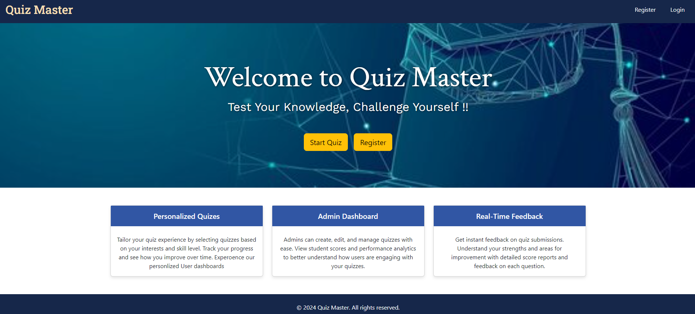
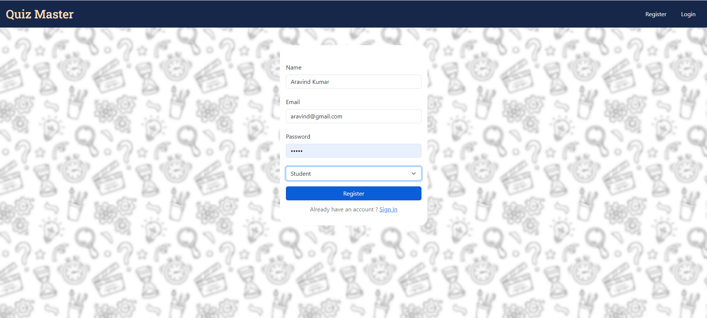
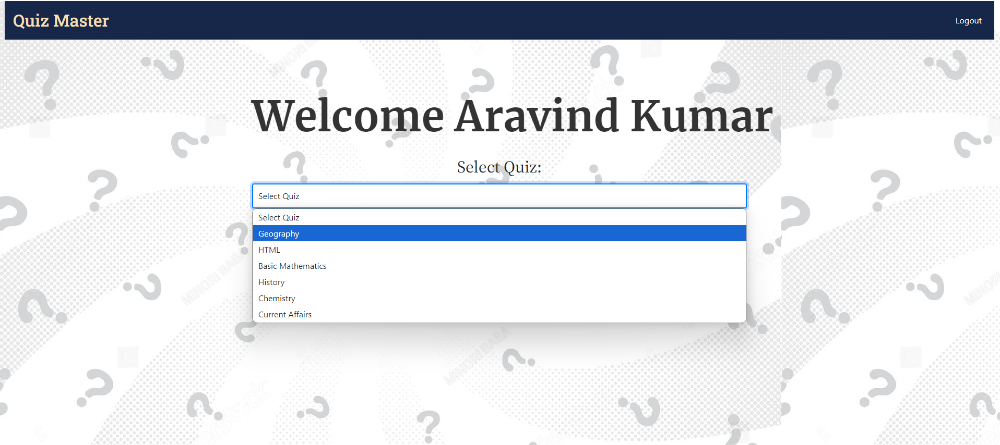
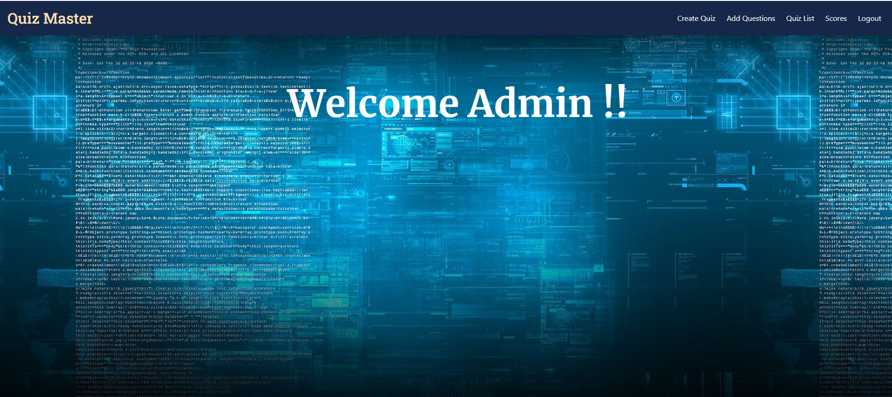
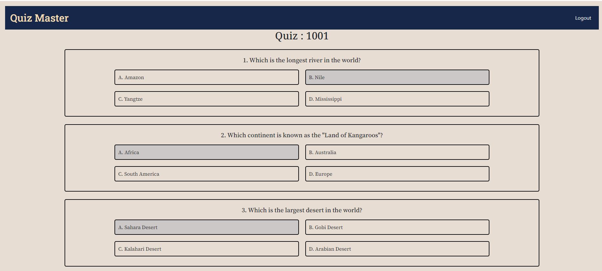
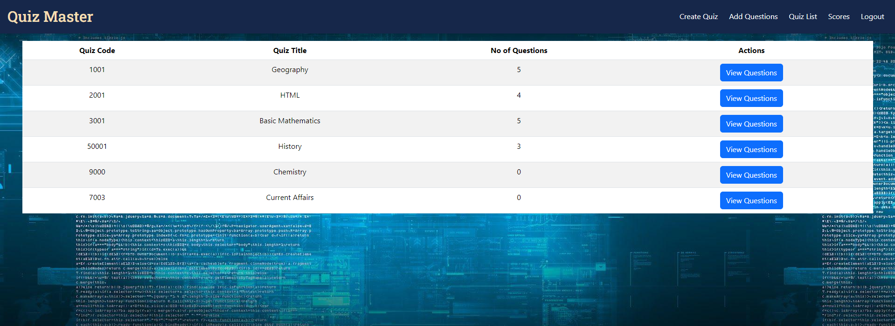
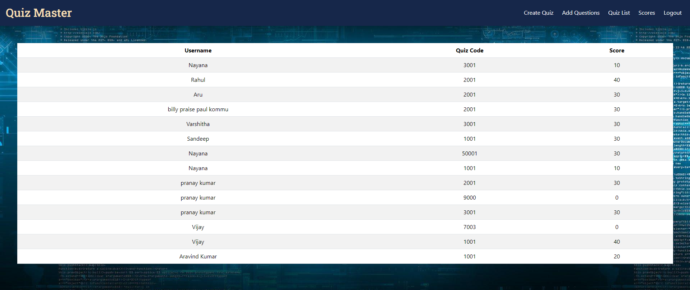

# 🚀 QuizMaster: Your Ultimate Online Quiz Platform! 🎉

## Overview
QuizMaster is an interactive online quiz application developed using the **MERN stack** (MongoDB, ExpressJS, ReactJS, NodeJS). This application provides a seamless experience for users to create, participate in, and manage quizzes.

## 🌟 Features

### 🧠 Personalized Quizzes
Tailor your quiz experience by selecting quizzes based on your interests and skill level. Track your progress and see how you improve over time with our personalized user dashboards.

### 📊 Admin Dashboard
Admins can easily create, edit, and manage quizzes. Gain insights into student scores and performance analytics to understand user engagement better.

### 🔍 Real-Time Feedback
Get instant feedback on quiz submissions! Understand your strengths and areas for improvement with detailed score reports and feedback on each question.

## How the MERN Stack Was Used

- 🗄️ **MongoDB**: Efficiently stored quiz data and user profiles.  
- 🌐 **ExpressJS**: Developed a RESTful API to manage user requests and quiz operations.  
- ⚛️ **ReactJS**: Built a dynamic and user-friendly interface for engaging quizzes.  
- 🚀 **NodeJS**: Powered the backend to handle asynchronous requests smoothly.  

## 📸 Screenshots

### Home Page

### Register/Login 

### User Dashboard

### Admin Dashboard

### User Quiz Interface

### Admin Quizzes List

### Admin Results List

## 🌐 Links

- **Frontend (Vercel)**: [QuizMaster Frontend](https://quiz-master-frontend-lilac.vercel.app/#/)  
- **Backend (Render)**: [QuizMaster Backend](https://quiz-master-backend-3.onrender.com)  

## Conclusion
I'm proud of the work done on QuizMaster and look forward to continuing my journey in software development! Check it out and let me know what you think!

## 🔗 Social Media
- **LinkedIn**: [My linkedIn Profile to connect with me](https://www.linkedin.com/in/aravind-kumar-muddana-563641275/)
